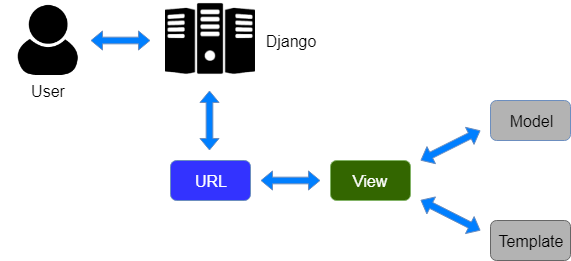

# Django Complete

## Installation
* Install uv -> An extremely fast Python package and project manager, written in Rust.
* uv venv -> create virtual env with name .venv
* .venv\Scripts\activate -> to activate virtual env
* uv pip install django -> Download Django in virtual wrapper, if uv not used it would install globally
* django-admin startproject DjangoFirst
* uv pip freeze > requirements.txt

## File structure
```
my_project/
├── manage.py
└── my_project/
    ├── __init__.py
    ├── asgi.py
    ├── settings.py
    ├── urls.py
    └── wsgi.py
```
* manage.py - <br>This is the entry point for managing the Django project. It is the file that is invoked first. It provides commands like running the development server, creating new apps, migrating data and more.
* my_project - <br>This directory contains the core settings and configuration files for your project.
* __init__.py - <br>This empty file denotes that the my_project directory is a Python package.
* asgi.py - <br>This file is used to manage asynchronous request in the project. It is primarily used for modern web framework and asynchronous task.
* settings.py - <br>This is the central configuration file for the project. Contains setting related to database connections, installed apps, template directories, static file and more.
* urls.py - <br>This define the url pattern for your project. It maps the url to specific views.
* wsgi.py - This file handles synchronous request in your application. Used for traditional web servers.

## MVT architecture

In Django, the architecture followed is Model-View-Template (MVT), the key components in MVT are:<br>
1. Model:<br>
The Model in Django handles the database layer. It is responsible for defining the structure of your database (e.g., tables, fields) and encapsulating business logic for data retrieval and storage. Each model class in Django corresponds to a database table, and its attributes correspond to table columns.<br>
Purpose: To manage data, store it, and handle relationships between data entities.<br>
Interaction: Models are used by views to query the database and return results.<br>
2. View:<br>
The View in Django is responsible for business logic and processing user requests. Views take user inputs, interact with the Model to retrieve necessary data, and pass that data to the Template for rendering.<br>
Purpose: To handle user requests, process data, and return the appropriate response (HTML, JSON, etc.).<br>
Interaction: Views query models and render templates based on the retrieved data.<br>
3. Template:<br>
The Template in Django handles the presentation layer. It is responsible for rendering the HTML or other formats that are returned to the user. Templates in Django are written in plain HTML, but they can also include template tags and logic to display dynamic content based on data passed by the view.<br>
Purpose: To render the data (usually HTML) in a format that is viewable by the user.<br>
Interaction: Templates are provided with context data from views.<br>

### Flow of MVT Architecture:
* User Request: The user sends a request to the Django application (e.g., accessing a web page via a URL).
* URL Dispatcher (not part of MVT): Django uses a URL dispatcher to map the request to the appropriate view based on the URL patterns defined in urls.py.
* View: The view function receives the request, processes it, interacts with the model (e.g., querying the database), and prepares the context data.
* Model: If required, the view queries the database via the model. The model handles the database operations and returns data to the view.
* Template: The view passes the context data to a template. The template renders the data in HTML (or other formats) and sends it back as a response to the user.
* Response: The rendered template is returned as the HTTP response, which the user sees in their browser.